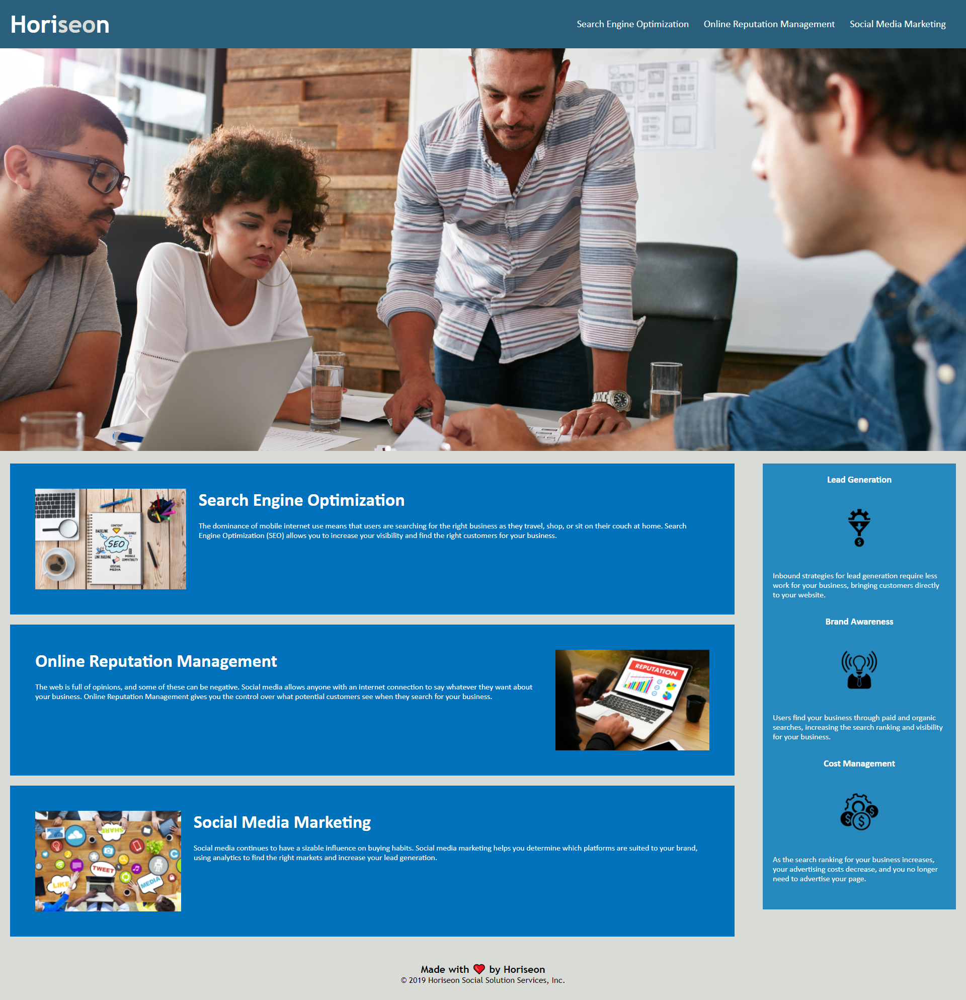

# Horiseon SEO Accessibility

## Purpose

* Review and make changes to the Horiseon Website to add accessibility through the use of more precise HTML semantic elements, alt attributes on image elements, and logical HTML structure.

* Tidy up and eliminate unnecessary CSS in order to improve the functionality of the website.

## Built with 

* HTML
* CSS

## Website

https://austingilmora.github.io/SEO-Accessibility/

 